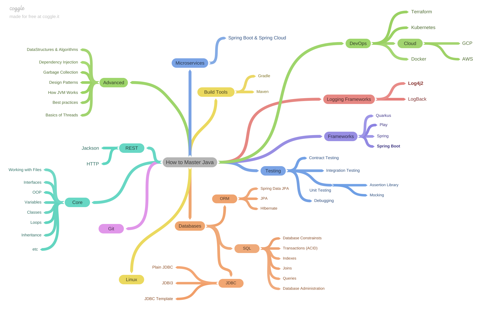

# JAVA Learning My Way

Java Collection Library
Java I/O
Generics
Annotations
Multithreading & Concurrency
Reflection API
JDBC

Lambda Expressions
Streams API
Optional Class
Functional Interfaces

Design Patterns
    Singleton
    Factory
    Dependency Injection

Solid Principles

Maven
